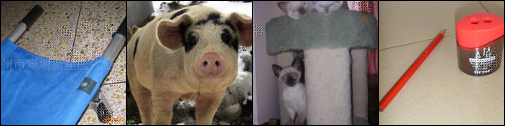
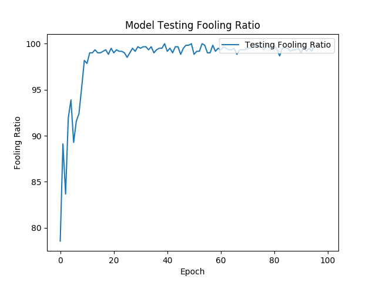
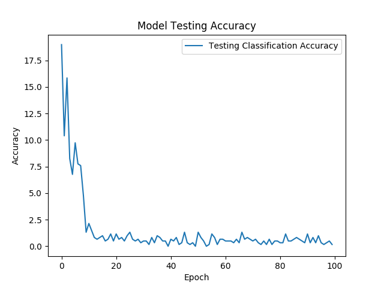

# Wavelet Based Generative Adversarial Perturbations (WGAP)
WGAP framework is based on the baseline model GAP "[Generative Adversarial Perturbations](https://github.com/OmidPoursaeed/Generative_Adversarial_Perturbations)". The perturbation is performed on time-scale domain instead of time domain. With WGAP, the model is able to perform structural attack.

## Wavelet Tansform High Level
The following diagram shows the wavelet decomposition high level


## WGAP High Level
The following diagram shows the wavelet based time-scale GAP high level. The perturtation is performed on time-scale (wavelet) domain, which aims to perturb high frequency structure details that can fool the early convolution layers.


## How to Train WGAP

### Required Python packages
1. torch==1.4.0
2. numpy==1.16.2
3. scipy==1.1.0
4. pytorch_wavelets==1.2.2
5. matplotlib==3.0.1
6. opencv-python==4.0.1.24
7. capturm==0.2.0
8. pytorch_ssim

### Install Required Package
1. pip install -r requirements.txt --user
2. Get the pytorch_ssim from https://github.com/Po-Hsun-Su/pytorch-ssim. The copy of pytorch_ssim is cloned in this repo.


### Download the imagenet Data
The training and validation imagenet dataset are downloaded from [Nvidia Jetson Inference](https://github.com/dusty-nv/jetson-inference/blob/master/docs/imagenet-training.md)

### Independent Validation Dataset
A seperated independent 1000 images dataset is obtained from [Prior-Guided-RGF](https://github.com/thu-ml/Prior-Guided-RGF)

### Train WGAP
```text
usage: train_WGAP.py [-h] [--imagenetTrain IMAGENETTRAIN]
                     [--imagenetVal IMAGENETVAL] [--batchSize BATCHSIZE]
                     [--testBatchSize TESTBATCHSIZE] [--nEpochs NEPOCHS]
                     [--ngf NGF] [--optimizer OPTIMIZER] [--lr LR]
                     [--beta1 BETA1] [--threads THREADS] [--seed SEED]
                     [--MaxIter MAXITER] [--MaxIterTest MAXITERTEST]
                     [--expname EXPNAME] [--checkpoint CHECKPOINT]
                     [--foolmodel FOOLMODEL] [--mode MODE] [--gpu_ids GPU_IDS]
                     [--wavelet_type WAVELET_TYPE]

time-scale generative adversarial perturbations

optional arguments:
  -h, --help            show this help message and exit
  --imagenetTrain IMAGENETTRAIN
                        ImageNet train root
  --imagenetVal IMAGENETVAL
                        ImageNet val root
  --batchSize BATCHSIZE
                        training batch size
  --testBatchSize TESTBATCHSIZE
                        testing batch size
  --nEpochs NEPOCHS     number of epochs to train for
  --ngf NGF             generator filters in first conv layer
  --optimizer OPTIMIZER
                        optimizer: "adam" or "sgd"
  --lr LR               Learning Rate. Default=0.002
  --beta1 BETA1         beta1 for adam. default=0.5
  --threads THREADS     number of threads for data loader to use
  --seed SEED           random seed to use. Default=123
  --MaxIter MAXITER     Iterations in each Epoch
  --MaxIterTest MAXITERTEST
                        Iterations in each Epoch
  --expname EXPNAME     experiment name, output folder
  --checkpoint CHECKPOINT
                        path to starting checkpoint
  --foolmodel FOOLMODEL
                        model to fool: "incv3", "vgg16", "vgg19", "resnet18",
                        "resnet50" or "densenet161"
  --mode MODE           mode: "train" or "test"
  --gpu_ids GPU_IDS     gpu ids: e.g. 0 or 0,1 or 1,2.
  --wavelet_type WAVELET_TYPE
                        wavelet scale (1=1st wavelet; 2=2nd wavelet; 3=3rd
                        wavelet
```

### Sample Results
The following images/plot shows sample result after running  script





The following shows the fooling ratio and classification accuracy



The following shows the comparison beween GAP and different scale WGAP


### Interpret Model Vis Saliency Map
  |  
  |  
  |  
  |  
